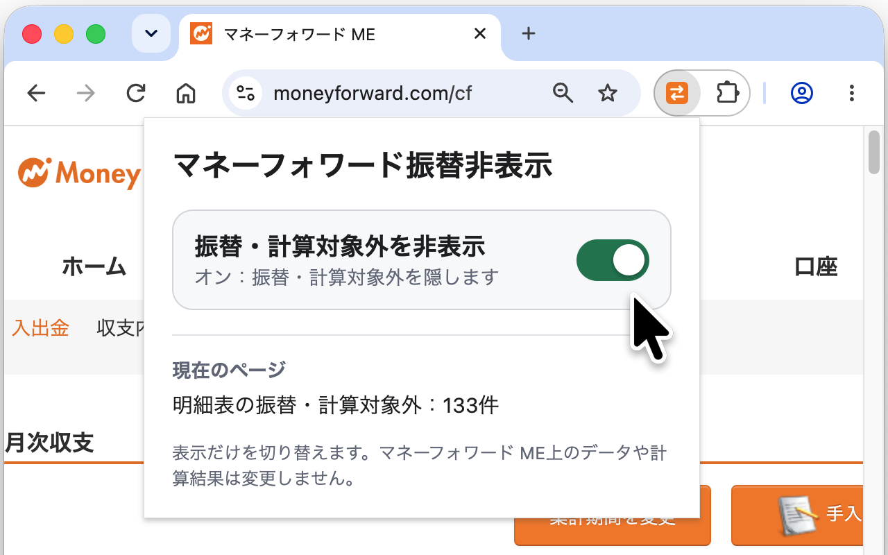
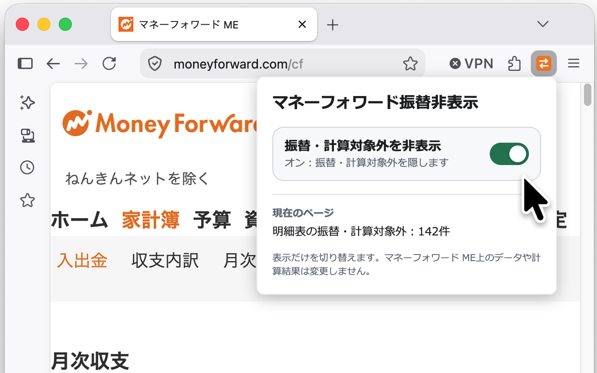
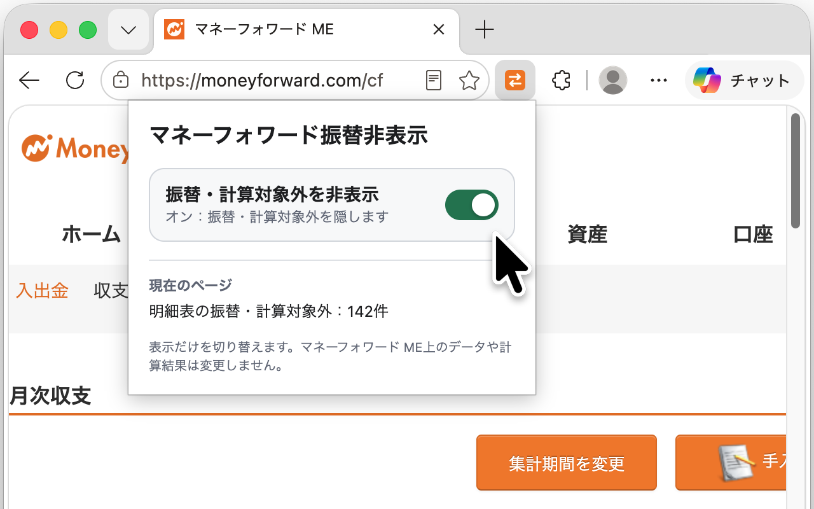

# 🚀 マネーフォワード振替非表示

**マネーフォワード振替非表示** は、マネーフォワード ME Web版で振替および手動で計算対象外にした明細を画面上から隠すブラウザ拡張機能です。

## インストール方法

お使いのブラウザの拡張機能ストアからインストールできます：

- [Chrome / Brave](https://chrome.google.com/webstore)
- [Firefox](https://addons.mozilla.org/ja/firefox/)
- [Edge](https://microsoftedge.microsoft.com/addons)

## 使用方法

1. 拡張機能のアイコンをブラウザのツールバーにピン留めします。
2. マネーフォワード ME Web版のページを開きます。
3. 拡張機能のスイッチを操作して、振替・計算対象外明細の表示・非表示を切り替えます。
4. 振替・計算対象外明細が非表示になっていることを確認します。

これは、マネーフォワード ME Web版で振替や計算対象外が多い場合に、必要な情報を効率的に確認するのに役立ちます。

## 免責

マネーフォワードホーム株式会社および株式会社マネーフォワードの公式拡張機能ではありません。

## プライバシー

本拡張機能のデータの取り扱いについては、[プライバシーポリシー](./PRIVACY.md)をご覧ください。
